# TAXI2 - Documentacion Tecnica Completa

## Indice

1. [Descripcion Funcional](#1-descripcion-funcional)
2. [Arquitectura del Sistema](#2-arquitectura-del-sistema)
3. [Stack Tecnologico](#3-stack-tecnologico)
4. [Modelo de Datos](#4-modelo-de-datos)
5. [Flujo General de Datos](#5-flujo-general-de-datos)
6. [Ingesta de Datos: Scrapers Automaticos](#6-ingesta-de-datos-scrapers-automaticos)
7. [Ingesta de Datos: Carga Manual de Archivos](#7-ingesta-de-datos-carga-manual-de-archivos)
8. [Parsers de Archivos](#8-parsers-de-archivos)
9. [Calculo de Liquidacion (Settlement)](#9-calculo-de-liquidacion-settlement)
10. [Dashboard de KPIs](#10-dashboard-de-kpis)
11. [Deteccion de Incidencias](#11-deteccion-de-incidencias)
12. [Exportacion de Datos](#12-exportacion-de-datos)
13. [Autenticacion y Seguridad](#13-autenticacion-y-seguridad)
14. [API REST v1](#14-api-rest-v1)
15. [Sistema de Trabajos Asincronos](#15-sistema-de-trabajos-asincronos)
16. [Cumplimiento GDPR](#16-cumplimiento-gdpr)
17. [Despliegue y Operaciones](#17-despliegue-y-operaciones)
18. [Estructura de Archivos del Proyecto](#18-estructura-de-archivos-del-proyecto)

---

## 1. Descripcion Funcional

TAXI2 es un sistema integral de gestion de flotas de taxi que automatiza la recopilacion de datos de viajes desde multiples plataformas, calcula las liquidaciones diarias de los conductores y genera informes financieros. El sistema esta diseñado para propietarios de licencias de taxi que operan con multiples conductores y vehiculos.

### Funcionalidades principales

- **Agregacion multi-plataforma**: Recopila datos de viajes de Prima (taximetro), FreeNow (app de movilidad) y Uber
- **Importacion de datos financieros**: Extractos bancarios La Caixa (pagos TPV/VISA), gastos de combustible (Petroprix, Repsol), gastos manuales
- **Liquidacion diaria**: Calculo automatizado de la liquidacion conductor-propietario con comisiones escalonadas
- **Scraping automatico**: Descarga automatica de datos desde los portales de FreeNow y Prima mediante navegador headless
- **Deteccion de incidencias**: Identificacion automatica de viajes sospechosos (posibles tiquets nulos)
- **Dashboard de KPIs**: Metricas mensuales comparativas por conductor (ingresos, km, tasa de ocupacion, combustible)
- **Exportacion**: Generacion de informes de liquidacion en Excel y PDF
- **API REST**: Acceso programatico a viajes, conductores, vehiculos y resumenes
- **Gestion administrativa**: Alta/baja de conductores y vehiculos, configuracion de comisiones

### Usuarios del sistema

| Rol | Acceso | Funciones |
|-----|--------|-----------|
| **Propietario (admin)** | Total | Dashboard, liquidacion, subir archivos, sincronizar, administrar conductores/vehiculos, validar incidencias |
| **Conductor** | Limitado | Dashboard propio, consulta de viajes propios |

### Plataformas integradas

| Plataforma | Tipo de dato | Formato | Metodo de ingesta |
|------------|-------------|---------|-------------------|
| **Prima** (Taxitronic) | Viajes taximetro | CSV (;) | Scraper automatico + carga manual |
| **FreeNow** | Viajes app | CSV (,) | Scraper automatico + carga manual |
| **Uber** | Resumenes diarios | CSV (,) | Carga manual |
| **La Caixa** | Extracto bancario TPV | XLS/XLSX | Carga manual |
| **Petroprix** | Gastos combustible | CSV (,) | Carga manual |
| **Repsol/Solred** | Gastos combustible | XLSX | Carga manual |

---

## 2. Arquitectura del Sistema

### 2.1 Diagrama de arquitectura general

```mermaid
graph TB
    subgraph "Usuarios"
        ADMIN["Administrador/Propietario<br>(Navegador Web)"]
        DRIVER["Conductor<br>(Navegador Web)"]
        API_CLIENT["Cliente API<br>(Bearer Token)"]
    end

    subgraph "TAXI2 System"
        subgraph "Frontend"
            TEMPLATES["Jinja2 Templates<br>+ Bootstrap 5"]
        end

        subgraph "Backend (FastAPI)"
            MAIN["FastAPI App<br>(src/main.py)"]
            AUTH["Auth Router<br>JWT Cookie"]
            DASH["Dashboard"]
            LIQ["Liquidacion"]
            UPLOAD["Upload"]
            SYNC["Sync"]
            TRIPS["Trips"]
            ADMIN_R["Admin"]
            VALID["Validation"]
            EXPORT["Export"]
            API_V1["API v1"]
        end

        subgraph "Servicios"
            CALC["Settlement Calculator"]
            INCIDENT["Incident Detector"]
            EXCEL_EXP["Excel Exporter"]
            PDF_EXP["PDF Exporter"]
            JOB_SVC["Job Service"]
            AUTH_SVC["Auth Service"]
            TRIP_SVC["Trip Service"]
            GDPR_SVC["GDPR Service"]
        end

        subgraph "Parsers"
            FN_PARSER["FreeNow Parser"]
            PRIMA_PARSER["Prima Parser"]
            UBER_PARSER["Uber Parser"]
            LC_PARSER["La Caixa Parser"]
            PETRO_PARSER["Petroprix Parser"]
            REPSOL_PARSER["Repsol Parser"]
        end

        subgraph "Workers (Arq)"
            WORKER["Arq Worker<br>(src/workers/tasks.py)"]
        end

        subgraph "Scrapers (Playwright)"
            FN_SCRAPER["FreeNow Scraper"]
            PRIMA_SCRAPER["Prima Scraper"]
        end

        REDIS[("Redis<br>Cola de trabajos")]
        DB[("PostgreSQL<br>Base de datos")]
    end

    subgraph "Plataformas Externas"
        FN_PORTAL["FreeNow Portal<br>portal.free-now.com"]
        PRIMA_PORTAL["Prima Portal<br>prima.taxitronic.com"]
    end

    ADMIN --> MAIN
    DRIVER --> MAIN
    API_CLIENT --> API_V1

    MAIN --> AUTH
    MAIN --> DASH
    MAIN --> LIQ
    MAIN --> UPLOAD
    MAIN --> SYNC
    MAIN --> TRIPS
    MAIN --> ADMIN_R
    MAIN --> VALID
    MAIN --> EXPORT
    MAIN --> API_V1

    LIQ --> CALC
    LIQ --> EXCEL_EXP
    LIQ --> PDF_EXP
    VALID --> INCIDENT
    SYNC --> JOB_SVC
    JOB_SVC --> REDIS
    WORKER --> REDIS
    WORKER --> FN_SCRAPER
    WORKER --> PRIMA_SCRAPER
    WORKER --> DB

    FN_SCRAPER --> FN_PORTAL
    PRIMA_SCRAPER --> PRIMA_PORTAL

    UPLOAD --> FN_PARSER
    UPLOAD --> PRIMA_PARSER
    UPLOAD --> UBER_PARSER
    UPLOAD --> LC_PARSER
    UPLOAD --> PETRO_PARSER
    UPLOAD --> REPSOL_PARSER

    MAIN --> DB
    SYNC --> DB
    UPLOAD --> DB
    LIQ --> DB
    DASH --> DB
```

### 2.2 Diagrama de contenedores Docker

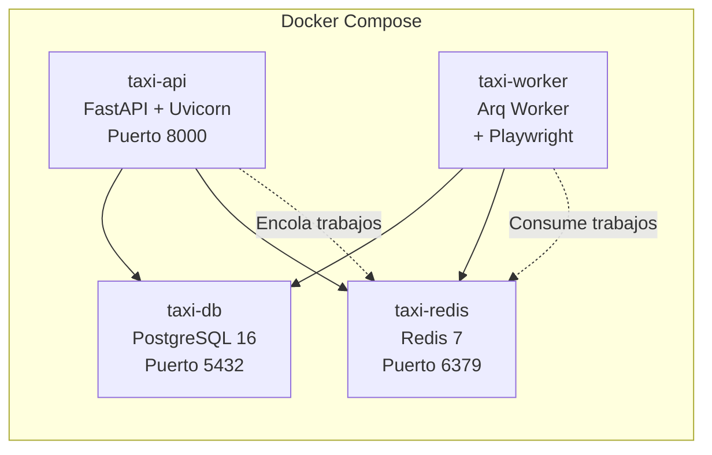

---

## 3. Stack Tecnologico

| Componente | Tecnologia | Version |
|-----------|-----------|---------|
| **Lenguaje** | Python | 3.11+ |
| **Framework web** | FastAPI | 0.100+ |
| **ORM** | SQLAlchemy | 2.0 |
| **Migraciones** | Alembic | 1.12+ |
| **Base de datos** | PostgreSQL | 16 |
| **Cola de trabajos** | Arq (Redis) | 0.25+ |
| **Cache/Broker** | Redis | 7 |
| **Scraping** | Playwright | 1.40+ |
| **Templates** | Jinja2 | 3.1+ |
| **CSS** | Bootstrap | 5.3.3 |
| **Excel** | openpyxl | 3.1+ |
| **PDF** | fpdf2 | 2.7+ |
| **Auth** | PyJWT + bcrypt | - |
| **Rate Limiting** | slowapi | - |
| **Contenedores** | Docker + Docker Compose | - |
| **CI/CD** | GitHub Actions | - |
| **Servidor** | Uvicorn (ASGI) | - |

---

## 4. Modelo de Datos

### 4.1 Diagrama Entidad-Relacion

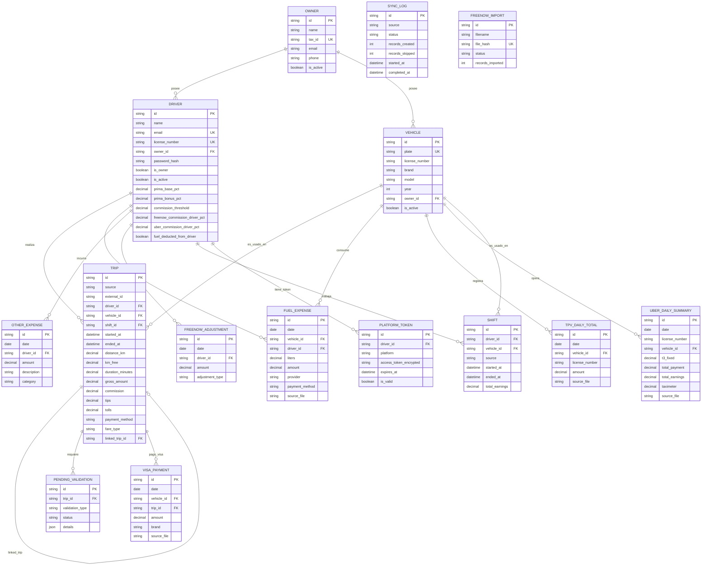

### 4.2 Descripcion de modelos clave

#### Driver (Conductor)
Contiene la configuracion de comisiones que determina como se calcula la liquidacion:
- `prima_base_pct`: Porcentaje base del conductor (ej: 40%)
- `prima_bonus_pct`: Porcentaje bonus si supera umbral (ej: 45%)
- `commission_threshold`: Umbral de recaudacion neta para bonus (ej: 300 EUR)
- `freenow_commission_driver_pct`: Si > 0, el conductor asume la comision de FreeNow
- `fuel_deducted_from_driver`: Si true, la gasolina se descuenta del anticipado

#### Trip (Viaje)
Registro unificado de viajes de todas las plataformas:
- `source`: "prima", "freenow" o "uber"
- `fare_type`: "FIXED" o "METERED" (solo FreeNow)
- `payment_method`: "CASH", "APP", "efectivo", "tarjeta"
- `linked_trip_id`: Enlace Prima ↔ FreeNow/Uber para evitar doble contabilidad

#### Formato de `license_number` del conductor
El campo `license_number` del conductor sigue el formato: `"361 - 0397MSS"` donde:
- `361` = Numero de licencia del taxi
- `0397MSS` = Matricula del vehiculo asociado

Este formato se usa para resolver automaticamente la relacion conductor ↔ vehiculo.

---

## 5. Flujo General de Datos

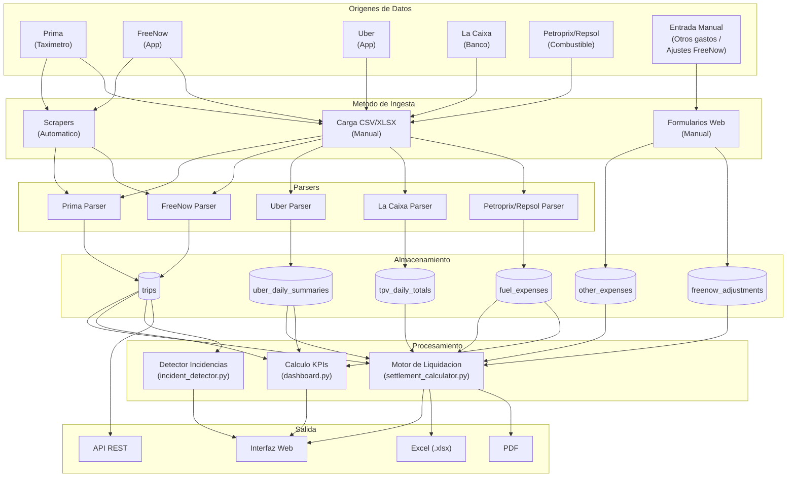

---

## 6. Ingesta de Datos: Scrapers Automaticos

Los scrapers utilizan **Playwright** (navegador Chromium headless) para automatizar la descarga de datos desde los portales web de FreeNow y Prima.

### 6.1 Diagrama de secuencia: Sincronizacion FreeNow

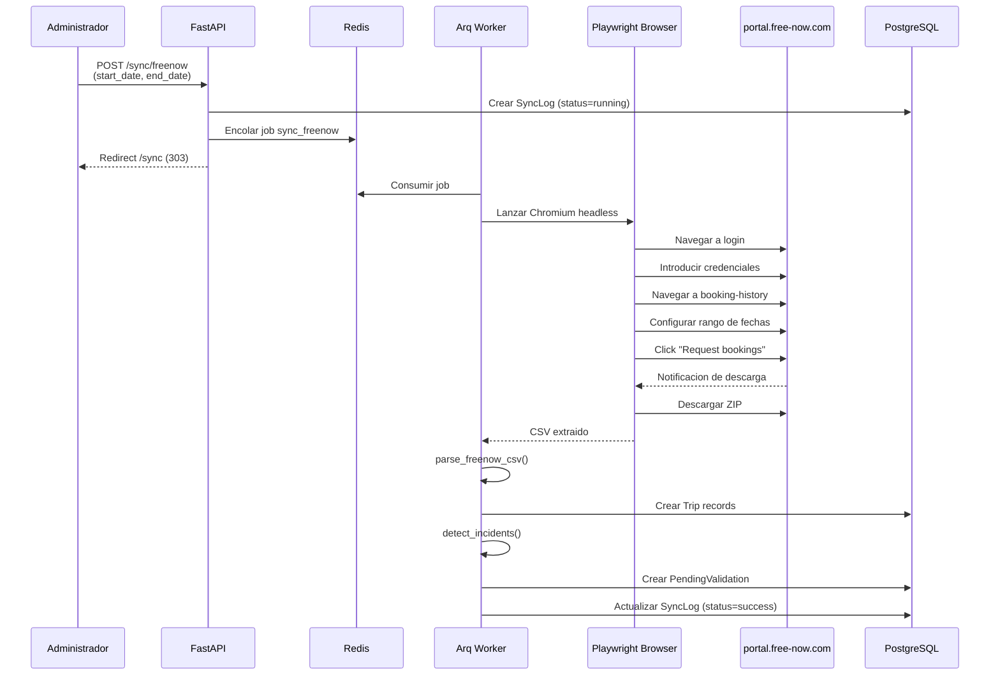

### 6.2 Diagrama de secuencia: Sincronizacion Prima

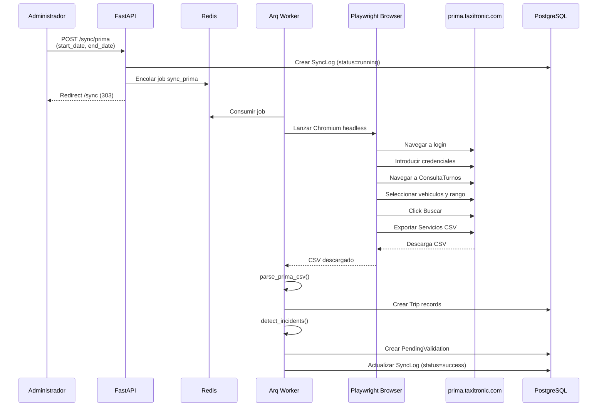

### 6.3 Soporte Multi-Cuenta FreeNow

El sistema soporta multiples cuentas de FreeNow porque las licencias de taxi estan distribuidas en diferentes cuentas:

| Cuenta | Etiqueta | Licencias |
|--------|----------|-----------|
| Cuenta 1 | `account1` | 092, 1061 |
| Cuenta 2 | `account2` | 361 |

La configuracion se gestiona en `src/config.py` mediante `Settings.get_freenow_accounts()`, que devuelve la lista de cuentas con sus credenciales.

---

## 7. Ingesta de Datos: Carga Manual de Archivos

### 7.1 Flujo general de carga de archivos

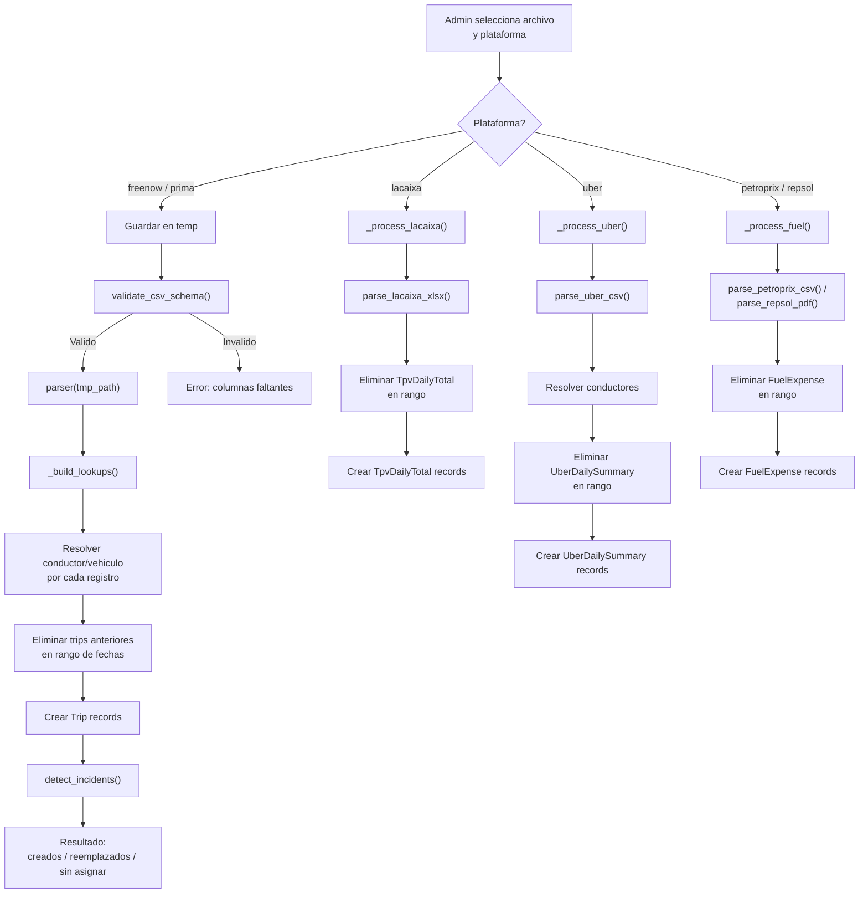

### 7.2 Resolucion automatica de conductor y vehiculo

El sistema resuelve automaticamente la asignacion de conductor y vehiculo a partir de los metadatos del archivo:

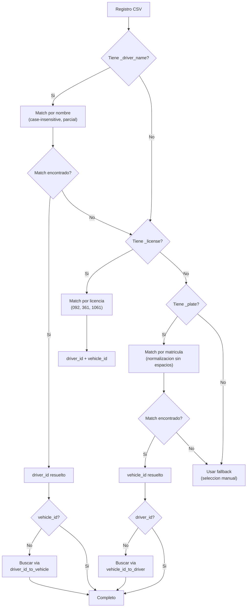

### 7.3 Estrategia de reemplazo de datos

Al subir un nuevo archivo, el sistema **reemplaza** los datos existentes del mismo tipo en el rango de fechas del archivo:

| Tipo de dato | Clave de deduplicacion | Accion |
|-------------|----------------------|--------|
| Trips (FreeNow/Prima) | source + rango de fechas | DELETE anteriores en rango, INSERT nuevos |
| UberDailySummary | license_number + rango de fechas | DELETE anteriores, INSERT nuevos |
| TpvDailyTotal | license_number + rango de fechas | DELETE anteriores, INSERT nuevos |
| FuelExpense | vehicle_id + provider + rango de fechas | DELETE anteriores, INSERT nuevos |
| FreenowAdjustment | driver_id + date + adjustment_type | DELETE anterior, INSERT nuevo |
| OtherExpense | Sin reemplazo | Solo INSERT (acumulativo) |

### 7.4 Entrada manual: Otros Gastos

Formulario para registrar gastos no recurrentes del conductor:
- **Ruta**: `POST /upload/otros-gastos`
- **Campos**: conductor, fecha (DD/MM/YY), importe (EUR), concepto
- **Almacenamiento**: Tabla `other_expenses`, categoria "otro"

### 7.5 Entrada manual: Ajustes FreeNow (Otros/Incentivos)

Formulario para registrar bonificaciones e incentivos de FreeNow:
- **Ruta**: `POST /upload/freenow-ajustes`
- **Campos**: conductor, fecha_otros + importe_otros, fecha_incentivos + importe_incentivos
- **Tipos**: `otros` (cargos adicionales), `incentivos` (bonificaciones)
- **Comportamiento**: Cada nuevo valor **reemplaza** al anterior para el mismo conductor+fecha+tipo
- **Permite valor 0**: Para eliminar un ajuste previamente registrado

---

## 8. Parsers de Archivos

### 8.1 FreeNow Parser (`scripts/parsers/freenow_parser.py`)

| Aspecto | Detalle |
|---------|---------|
| **Formato** | CSV, delimitador: coma |
| **Encoding** | UTF-8 |
| **Filtro** | Solo filas con `BOOKING STATE = "ACCOMPLISHED"` |
| **Fechas** | ISO 8601 con timezone (ej: `2026-02-01T08:30:00+01:00`) |
| **Decimales** | Punto como separador |

**Columnas requeridas:**

| Columna CSV | Campo Trip | Descripcion |
|------------|-----------|-------------|
| BOOKING ID | external_id | ID unico del viaje |
| TOUR VALUE | gross_amount | Importe bruto del viaje |
| TOUR TIP | tips | Propina |
| TOLL VALUE | tolls | Peajes |
| TAX PERCENTAGE | taxes_vat | Porcentaje IVA |
| PICKUP DATE | started_at | Fecha/hora inicio |
| CLOSED DATE | ended_at | Fecha/hora fin |
| PAYMENT METHOD | payment_method | "CASH" o "APP" |
| FARE TYPE | fare_type | "FIXED" o "METERED" |
| DRIVER FIRST NAME + LAST NAME | _driver_name | Para resolucion automatica |
| LICENCE PLATE | _plate | Para resolucion automatica |

**Distincion FIXED vs METERED:**
- **FIXED**: FreeNow cobra tarifa fija. Se incluye en recaudacion como ingreso adicional al taximetro.
- **METERED**: FreeNow usa el taximetro. El importe ya esta registrado en Prima. No se suma a recaudacion para evitar duplicidad.

### 8.2 Prima Parser (`scripts/parsers/prima_parser.py`)

| Aspecto | Detalle |
|---------|---------|
| **Formato** | CSV, delimitador: punto y coma (;) |
| **Encoding** | UTF-8 |
| **Fechas** | `DD/MM/YYYY H:MM:SS` o `DD/MM/YY H:MM` (naive, sin timezone) |
| **Decimales** | Coma como separador (formato europeo) |

**Columnas requeridas:**

| Columna CSV | Campo Trip | Descripcion |
|------------|-----------|-------------|
| TripNumber | external_id | Numero de viaje |
| DateTripStart | started_at | Fecha/hora inicio (naive) |
| DateTripEnd | ended_at | Fecha/hora fin |
| AmountTotalPaid | gross_amount | Importe total |
| AmountTips | tips | Propinas |
| AmountTolls | tolls | Peajes |
| PaymentMode | payment_method | Modo de pago |
| km | distance_km | Km ocupados |
| km_free | km_free | Km en vacio |
| DriverName | _driver_name | Mapa conductor (1→NOMBRE) |
| License | _license | Numero licencia |

**Mapa de conductores Prima:**
El CSV de Prima usa codigos numericos para conductores (ej: "1", "2"). El parser mantiene un mapa interno que traduce estos codigos a nombres completos.

### 8.3 Uber Parser (`scripts/parsers/uber_parser.py`)

| Aspecto | Detalle |
|---------|---------|
| **Formato** | CSV, delimitador: coma |
| **Encoding** | UTF-8-sig (con BOM) |
| **Fechas** | Formato fecha en columna |
| **Salida** | Lista de resumenes diarios (no viajes individuales) |

**Campos de salida:**

| Campo | Descripcion |
|-------|-------------|
| date | Fecha del resumen |
| _driver_name | Nombre del conductor |
| t3_fixed | Ganancias - Taximetro (importe que suma a recaudacion) |
| total_payment | Pago total de Uber al conductor |
| total_earnings | Ganancias totales |

**Nota**: Uber no genera registros `Trip` individuales. Genera registros `UberDailySummary` con totales diarios por licencia.

### 8.4 La Caixa Parser (`scripts/parsers/lacaixa_parser.py`)

| Aspecto | Detalle |
|---------|---------|
| **Formato** | XLS o XLSX (extracto bancario) |
| **Deteccion** | Celda (1,1) contiene "Moviments del compte" |
| **Filtro** | Movimientos que empiezan por ON34, ON35 o ON36 |

**Mapeo de terminales a licencias:**

| Prefijo terminal | Licencia |
|-----------------|----------|
| ON34 (34) | 092 |
| ON35 (35) | 1061 |
| ON36 (36) | 361 |

**Salida:** Lista de `{date, license_number, amount}` agregados por dia y licencia.

### 8.5 Petroprix Parser (`scripts/parsers/petroprix_parser.py`)

| Aspecto | Detalle |
|---------|---------|
| **Formato** | CSV, delimitador: coma |
| **Decimales** | Europeo (coma en posicion de columnas) |
| **Fecha** | `DD-MM-YYYY HH:MM:SS` |

**Salida:** `FuelExpense` con date, _plate, liters, amount, provider="petroprix", payment_method

### 8.6 Repsol/Solred Parser (`scripts/parsers/repsol_parser.py`)

| Aspecto | Detalle |
|---------|---------|
| **Formato** | XLSX |
| **Litros** | Formato "39,120 l" o "43.81" |
| **Importe** | Numerico o con coma |

**Salida:** `FuelExpense` con date, _plate, liters, amount, provider="repsol", payment_method

---

## 9. Calculo de Liquidacion (Settlement)

El sistema de liquidacion es el nucleo financiero de la aplicacion. Calcula diariamente cuanto debe cobrar o pagar cada conductor al propietario.

### 9.1 Diagrama del flujo de calculo

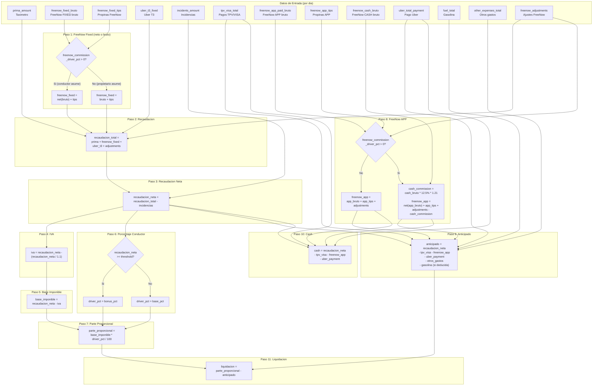

### 9.2 Formula paso a paso

#### Paso 1: FreeNow Fixed (neto o bruto)

Determina como entra FreeNow FIXED en la recaudacion dependiendo de quien asume la comision:

**Si el conductor asume la comision** (`freenow_commission_driver_pct > 0`):
```
freenow_fixed = calculate_freenow_net(bruto) + tips
```

**Si el propietario asume la comision** (`freenow_commission_driver_pct == 0`):
```
freenow_fixed = bruto + tips
```

Donde `calculate_freenow_net(bruto)` calcula:
```
comision = bruto * 12.5%
comision_con_iva = comision * 1.21
neto = bruto - comision_con_iva

Ejemplo: bruto = 100 EUR
  comision = 100 * 0.125 = 12.50
  comision_con_iva = 12.50 * 1.21 = 15.13
  neto = 100 - 15.13 = 84.88 EUR
```

Los ajustes de FreeNow (otros/incentivos) se suman despues:
```
freenow_fixed = freenow_fixed + freenow_adjustments
```

#### Paso 2: Recaudacion Total

Suma todos los ingresos del dia:
```
recaudacion_total = prima_amount + freenow_fixed + uber_t3_fixed
```

#### Paso 3: Recaudacion Neta

Resta las incidencias (tiquets nulos confirmados):
```
recaudacion_neta = recaudacion_total - incidents_amount
```

#### Paso 4: IVA (10%)

Extrae el IVA incluido en la recaudacion neta:
```
iva = recaudacion_neta - (recaudacion_neta / 1.1)

Ejemplo: recaudacion_neta = 200 EUR
  iva = 200 - (200 / 1.1) = 200 - 181.82 = 18.18 EUR
```

#### Paso 5: Base Imponible

Recaudacion sin IVA:
```
base_imponible = recaudacion_neta - iva

Ejemplo: 200 - 18.18 = 181.82 EUR
```

#### Paso 6: Porcentaje del Conductor

Sistema de comision escalonada:
```
Si recaudacion_neta >= commission_threshold:
    driver_pct = prima_bonus_pct  (ej: 45%)
Sino:
    driver_pct = prima_base_pct   (ej: 40%)

Si threshold == 0: siempre usa base_pct
```

#### Paso 7: Parte Proporcional

Lo que le corresponde al conductor de la recaudacion:
```
parte_proporcional = base_imponible * driver_pct / 100

Ejemplo: 181.82 * 40 / 100 = 72.73 EUR
```

#### Paso 8: FreeNow APP (pagos por transferencia)

Calcula lo que FreeNow ha pagado por transferencia:

**Si el propietario asume la comision** (`freenow_commission_driver_pct == 0`):
```
freenow_app = freenow_app_paid_bruto + freenow_app_tips + freenow_adjustments
```

**Si el conductor asume la comision** (`freenow_commission_driver_pct > 0`):
```
freenow_cash_commission = freenow_cash_bruto * 12.5% * 1.21

freenow_app = calculate_freenow_net(freenow_app_paid_bruto)
            + freenow_app_tips
            + freenow_adjustments
            - freenow_cash_commission
```

**Explicacion de la comision CASH**: FreeNow cobra su comision (12.5% + 21% IVA) sobre TODOS los viajes, incluidos los pagados en efectivo. Para los viajes CASH, FreeNow descuenta esta comision del pago por transferencia. Por eso se resta del `freenow_app`.

**Nota sobre fare_type**: `freenow_app_paid_bruto` incluye TODOS los viajes pagados por APP, tanto FIXED como METERED. No se filtra por `fare_type`.

#### Paso 9: Anticipado

Dinero que el conductor ya ha adelantado al propietario (lo que ha ingresado pero no es suyo):
```
anticipado = recaudacion_neta
           - tpv_visa_total       (cobrado por tarjeta/VISA)
           - freenow_app          (pagado por transferencia FreeNow)
           - uber_total_payment   (pagado por transferencia Uber)
           - other_expenses_total (gastos deducidos)
           - fuel_deduction       (gasolina, si fuel_deducted_from_driver)
```

#### Paso 10: Cash

Efectivo que tiene el conductor en mano:
```
cash = recaudacion_neta - tpv_visa_total - freenow_app - uber_total_payment
```

#### Paso 11: Liquidacion Final

Diferencia entre lo que le corresponde al conductor y lo que ya ha adelantado:
```
liquidacion = parte_proporcional - anticipado
```

| Resultado | Significado |
|-----------|------------|
| `liquidacion > 0` | El conductor ha adelantado mas de lo que le corresponde. El propietario le debe dinero. |
| `liquidacion < 0` | El conductor debe dinero al propietario (normalmente del efectivo recaudado). |
| `liquidacion == 0` | Estan en paz. |

### 9.3 Recopilacion de datos diarios

La funcion `_get_daily_data()` en `liquidacion.py` recopila todos los datos necesarios para un dia:

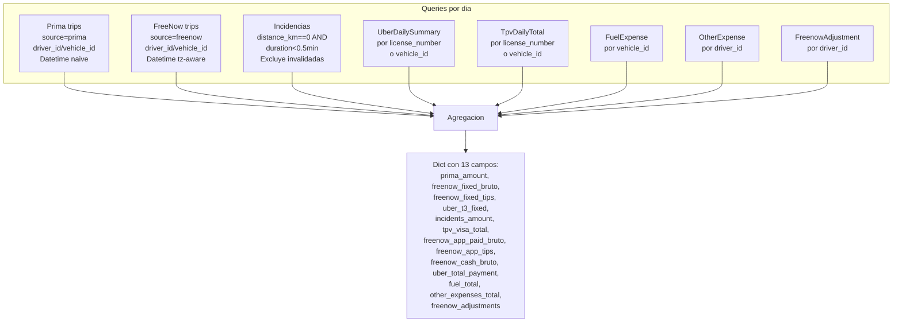

### 9.4 Manejo de zonas horarias

| Plataforma | Tipo de datetime | Zona horaria |
|-----------|-----------------|-------------|
| **Prima** | Naive (sin timezone) | Se asume hora local |
| **FreeNow** | Aware (con timezone) | Europe/Madrid |
| **Ventana diaria** | Prima: `datetime.combine(date, time.min)` | FreeNow: `datetime.combine(date, time.min, tzinfo=Europe/Madrid)` |

### 9.5 Ejemplo numerico completo

**Datos del dia:**
| Campo | Valor |
|-------|-------|
| prima_amount | 127.35 EUR |
| freenow_fixed_bruto | 70.20 EUR |
| freenow_fixed_tips | 5.00 EUR |
| uber_t3_fixed | 25.00 EUR |
| incidents_amount | 0.00 EUR |
| tpv_visa_total | 80.00 EUR |
| freenow_app_paid_bruto | 50.00 EUR |
| freenow_app_tips | 3.00 EUR |
| uber_total_payment | 60.00 EUR |
| fuel_total | 30.00 EUR |
| other_expenses_total | 0.00 EUR |
| freenow_adjustments | 10.00 EUR |

**Configuracion conductor:** base_pct=40%, bonus_pct=45%, threshold=300, freenow_commission_driver_pct=0, fuel_deducted=true

**Calculo:**

1. `freenow_fixed = 70.20 + 5.00 + 10.00 = 85.20` (propietario asume comision)
2. `recaudacion_total = 127.35 + 85.20 + 25.00 = 237.55`
3. `recaudacion_neta = 237.55 - 0.00 = 237.55`
4. `iva = 237.55 - (237.55 / 1.1) = 237.55 - 215.95 = 21.59`
5. `base_imponible = 237.55 - 21.59 = 215.95`
6. `driver_pct = 40%` (237.55 < 300 threshold)
7. `parte_proporcional = 215.95 * 40 / 100 = 86.38`
8. `freenow_app = 50.00 + 3.00 + 10.00 = 63.00` (propietario asume comision)
9. `anticipado = 237.55 - 80.00 - 63.00 - 60.00 - 0.00 - 30.00 = 4.55`
10. `cash = 237.55 - 80.00 - 63.00 - 60.00 = 34.55`
11. `liquidacion = 86.38 - 4.55 = 81.83` (propietario debe al conductor)

---

## 10. Dashboard de KPIs

El dashboard (`src/routes/dashboard.py`) muestra metricas mensuales comparativas para todos los conductores activos.

### 10.1 KPIs calculados

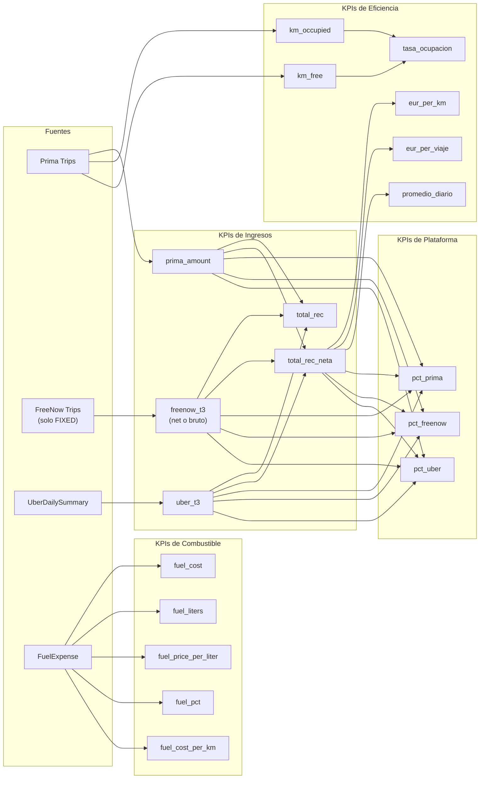

### 10.2 Formulas de KPIs

| KPI | Formula |
|-----|---------|
| total_rec | prima + freenow_bruto + freenow_tips + uber_t3 |
| total_rec_neta | prima + freenow_net + freenow_tips + uber_t3 |
| dias | Dias unicos trabajados (union Prima + FreeNow + Uber) |
| viajes | prima_trips + freenow_trips (Uber no cuenta individualmente) |
| eur_per_km | total_rec_neta / total_km |
| eur_per_viaje | total_rec_neta / viajes |
| promedio_diario | total_rec_neta / dias |
| tasa_ocupacion | km_occupied / total_km * 100 |
| fuel_pct | fuel_cost / total_rec_neta * 100 |
| fuel_cost_per_km | fuel_cost / total_km |

---

## 11. Deteccion de Incidencias

### 11.1 Criterios de deteccion

Un viaje se marca como posible incidencia si cumple AMBAS condiciones:
- `distance_km == 0` (sin desplazamiento)
- `duration_minutes < 0.5` (menos de 30 segundos)

Esto indica un posible tiquet nulo: el taximetro se abrio y cerro sin realizar un viaje real.

### 11.2 Flujo de validacion de incidencias

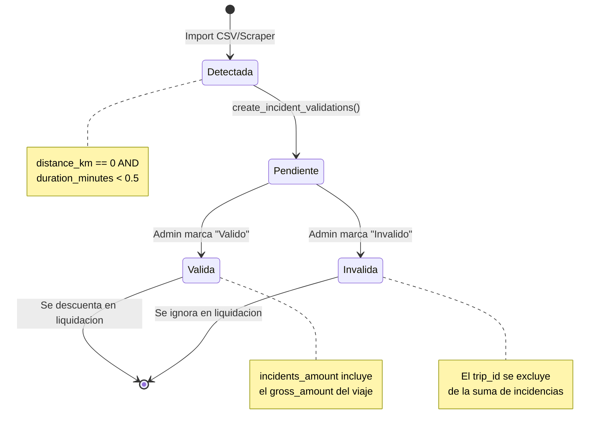

### 11.3 Impacto en la liquidacion

Los viajes marcados como **validos** (incidencias confirmadas) se suman a `incidents_amount` y se restan de `recaudacion_total` para obtener `recaudacion_neta`. Los marcados como **invalidos** se excluyen del calculo.

---

## 12. Exportacion de Datos

### 12.1 Columnas del informe de liquidacion

Los informes Excel y PDF contienen 17 columnas identicas:

| # | Columna | Campo interno | Descripcion |
|---|---------|---------------|-------------|
| 1 | Fecha | date | Dia del calculo |
| 2 | Prima | prima_amount | Ingresos taximetro |
| 3 | Inc | incidents_amount | Incidencias descontadas |
| 4 | FreenowT3 | freenow_fixed | FreeNow FIXED neto/bruto + ajustes |
| 5 | Uber T3 | uber_t3_fixed | Uber T3 fijo |
| 6 | Rec. Neta | recaudacion_neta | Recaudacion neta |
| 7 | % | driver_pct | Porcentaje conductor |
| 8 | TPV | tpv_visa_total | Total pagos VISA/tarjeta |
| 9 | App FN | freenow_app | Pagos FreeNow por app |
| 10 | App Uber | uber_total_payment | Pagos Uber |
| 11 | Cash | cash | Efectivo en mano |
| 12 | IVA | iva | IVA 10% |
| 13 | Parte Prop. | parte_proporcional | Parte proporcional conductor |
| 14 | Gasolina | fuel_total | Gastos combustible |
| 15 | Otros | other_expenses_total | Otros gastos |
| 16 | Anticipado | anticipado | Dinero adelantado |
| 17 | Liquidacion | liquidacion | Resultado final |

### 12.2 Excel (openpyxl)

- **Formato**: XLSX con estilos (cabeceras azules, totales resaltados)
- **Nombre archivo**: `liquidacion_{conductor}_{fecha_inicio}_{fecha_fin}.xlsx`
- **Formato numeros**: `#,##0.00`
- **Fila totales**: Suma de todas las columnas con fondo azul claro

### 12.3 PDF (fpdf2)

- **Orientacion**: Apaisado (landscape) A4
- **Fuente**: Helvetica 6pt
- **Filas alternadas**: Gris claro / blanco
- **Cabecera**: Fondo azul (68, 114, 196), texto blanco
- **Nombre archivo**: `liquidacion_{conductor}_{fecha_inicio}_{fecha_fin}.pdf`

---

## 13. Autenticacion y Seguridad

### 13.1 Flujo de autenticacion

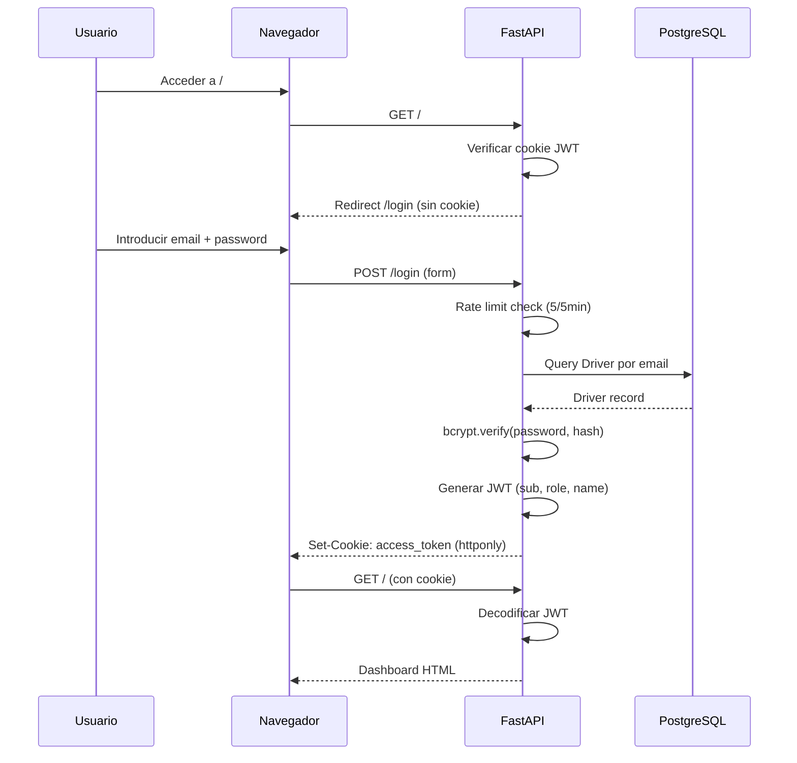

### 13.2 Configuracion de seguridad

| Medida | Implementacion |
|--------|---------------|
| **Cookies** | httponly=True, secure=True (produccion), samesite=lax |
| **JWT** | HS256, expiracion 24 horas |
| **Rate limiting** | 5 intentos login / 5 min por IP; 60 requests/min general |
| **CSRF** | Middleware que verifica Origin/Referer en POST/PUT/DELETE |
| **XSS** | Jinja2 auto-escaping en templates |
| **Path traversal** | Validacion de filenames en visualizacion de archivos |
| **Passwords** | bcrypt hashing |

### 13.3 Roles y permisos

| Ruta | Admin/Owner | Conductor |
|------|------------|-----------|
| `/` (Dashboard) | Todos los conductores | Solo sus datos |
| `/liquidacion` | Acceso completo | Sin acceso |
| `/upload` | Acceso completo | Sin acceso |
| `/sync` | Acceso completo | Sin acceso |
| `/admin` | Acceso completo | Sin acceso |
| `/validacion` | Acceso completo | Sin acceso |
| `/trips` | Todos los viajes | Solo sus viajes |
| `/export` | Acceso completo | Solo sus datos |
| `/api/v1/*` | Acceso completo | Solo sus datos |

---

## 14. API REST v1

### 14.1 Autenticacion API

```
POST /api/v1/auth/login?email=...&password=...
→ {"access_token": "eyJ...", "token_type": "bearer"}

Headers: Authorization: Bearer <token>
```

### 14.2 Endpoints disponibles

| Metodo | Ruta | Descripcion | Auth |
|--------|------|-------------|------|
| POST | `/api/v1/auth/login` | Obtener token Bearer | Publico |
| GET | `/api/v1/trips` | Listar viajes (paginado) | Bearer |
| GET | `/api/v1/trips/{id}` | Detalle de viaje | Bearer |
| GET | `/api/v1/drivers` | Listar conductores | Admin |
| GET | `/api/v1/drivers/{id}` | Detalle conductor | Bearer |
| GET | `/api/v1/vehicles` | Listar vehiculos | Admin |
| GET | `/api/v1/summary/daily` | Resumen diario | Bearer |
| GET | `/api/v1/summary/totals` | Totales del periodo | Bearer |
| GET | `/api/v1/sync/logs` | Logs de sincronizacion | Admin |
| POST | `/api/v1/sync/{source}` | Iniciar sincronizacion | Admin |
| GET | `/api/v1/validations` | Incidencias pendientes | Admin |
| POST | `/api/v1/validations/{id}/resolve` | Resolver incidencia | Admin |
| GET | `/api/v1/visa-payments` | Pagos VISA | Admin |
| GET | `/api/v1/fuel-expenses` | Gastos combustible | Admin |

### 14.3 Filtros comunes

| Parametro | Tipo | Descripcion |
|-----------|------|-------------|
| `driver_id` | string | Filtrar por conductor |
| `source` | string | Filtrar por plataforma (prima/freenow/uber) |
| `date_from` | date | Fecha inicio (YYYY-MM-DD) |
| `date_to` | date | Fecha fin (YYYY-MM-DD) |
| `page` | int | Pagina (default: 1) |
| `per_page` | int | Registros por pagina (default: 50) |

---

## 15. Sistema de Trabajos Asincronos

### 15.1 Arquitectura Arq + Redis

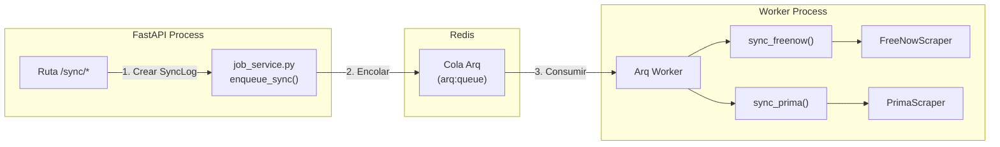

### 15.2 Ciclo de vida de un trabajo

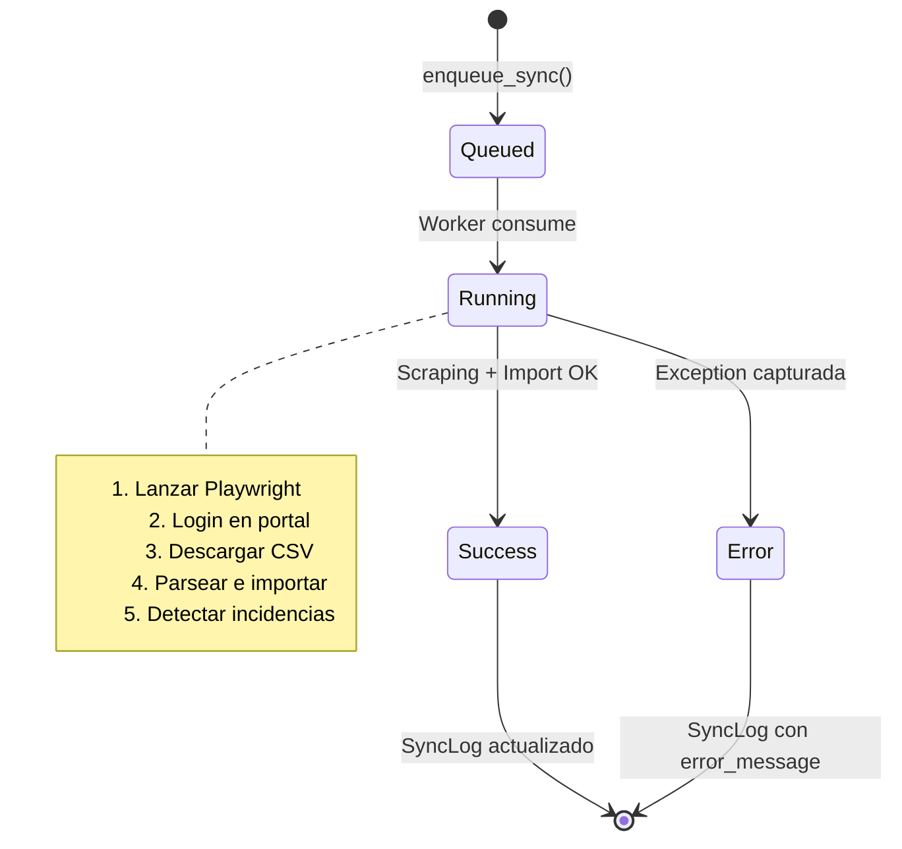

### 15.3 Proteccion contra ejecucion doble

Antes de encolar un nuevo trabajo, el sistema verifica que no haya un SyncLog con `status="running"` para la misma plataforma. Si existe, redirige sin encolar.

---

## 16. Cumplimiento GDPR

### 16.1 Anonimizacion de datos GPS

- **Politica**: Datos GPS (coordenadas origen/destino) se anulan despues de 90 dias
- **Funcion**: `gdpr_service.anonymize_old_gps(session)`
- **Campos**: `origin_lat`, `origin_lng`, `dest_lat`, `dest_lng` → `NULL`

### 16.2 Purgado de tokens

- **Politica**: Tokens de plataforma expirados o revocados se eliminan
- **Funcion**: `gdpr_service.purge_expired_tokens(session)`
- **Criterios**: `expires_at < now` OR `is_valid == False` OR `revoked_at IS NOT NULL`

### 16.3 Solicitudes de acceso (DSR)

- **Modelo**: `DsrRequest` para rastrear solicitudes de acceso a datos personales
- **Tipos**: access (consulta), deletion (eliminacion), rectification (correccion)

---

## 17. Despliegue y Operaciones

### 17.1 Arquitectura de despliegue

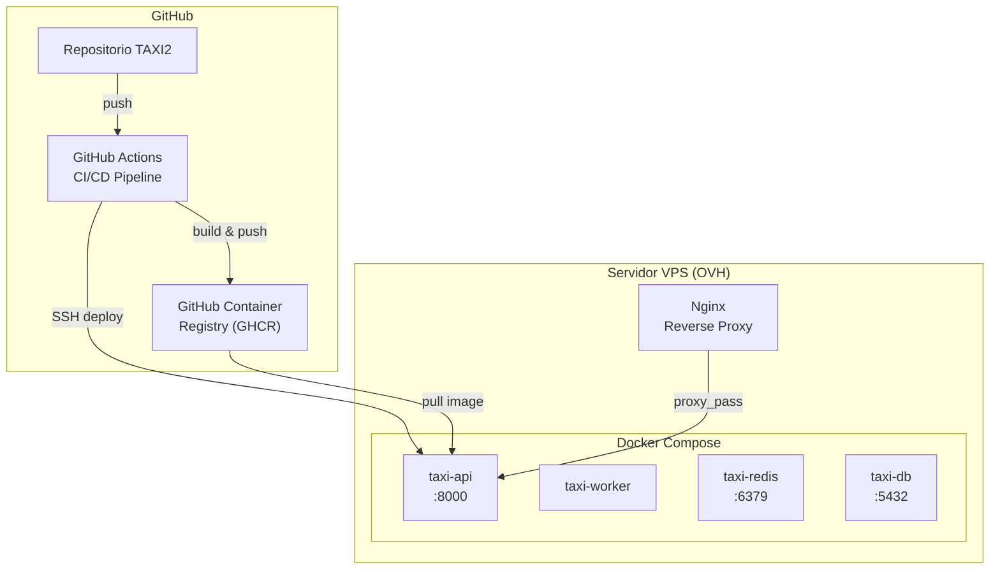

### 17.2 Pipeline CI/CD

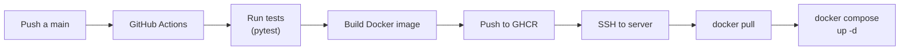

### 17.3 Variables de entorno requeridas

| Variable | Descripcion |
|----------|-------------|
| `DATABASE_URL` | URL PostgreSQL |
| `SECRET_KEY` | Clave para firma JWT |
| `REDIS_URL` | URL Redis |
| `FREENOW_EMAIL` / `FREENOW_PASSWORD` | Credenciales cuenta 1 |
| `FREENOW_2_EMAIL` / `FREENOW_2_PASSWORD` | Credenciales cuenta 2 |
| `PRIMA_EMAIL` / `PRIMA_PASSWORD` | Credenciales Prima |
| `SMTP_HOST` / `SMTP_PORT` / `SMTP_USER` / `SMTP_PASSWORD` | Config SMTP |
| `ALERT_EMAIL_TO` | Email para alertas |
| `ROOT_PATH` | Path base (para reverse proxy) |

### 17.4 Comandos operativos

```bash
# Levantar servicios
docker compose up -d

# Ver logs
docker logs taxi-api -f
docker logs taxi-worker -f

# Ejecutar migraciones
docker exec taxi-api alembic upgrade head

# Acceder a la base de datos
docker exec -it taxi-db psql -U taxi -d taxi_api

# Reconstruir imagen
docker compose build --no-cache taxi-api
docker compose up -d
```

---

## 18. Estructura de Archivos del Proyecto

```
TAXI2/
├── src/
│   ├── main.py                      # FastAPI app, routers, middleware
│   ├── config.py                    # Settings (env vars, credenciales)
│   ├── database.py                  # SQLAlchemy engine + session
│   ├── template_config.py           # Jinja2 templates config
│   ├── models/
│   │   ├── __init__.py              # Exporta todos los modelos
│   │   ├── owner.py                 # Owner model
│   │   ├── driver.py                # Driver model (comisiones)
│   │   ├── vehicle.py               # Vehicle model
│   │   ├── trip.py                  # Trip model (multi-plataforma)
│   │   ├── shift.py                 # Shift model
│   │   ├── fuel_expense.py          # FuelExpense model
│   │   ├── other_expense.py         # OtherExpense model
│   │   ├── freenow_adjustment.py    # FreenowAdjustment model
│   │   ├── tpv_daily_total.py       # TpvDailyTotal model
│   │   ├── uber_daily_summary.py    # UberDailySummary model
│   │   ├── visa_payment.py          # VisaPayment model
│   │   ├── pending_validation.py    # PendingValidation model
│   │   ├── sync_log.py              # SyncLog model
│   │   ├── freenow_import.py        # FreeNowImport model
│   │   ├── daily_summary.py         # DailySummary model
│   │   ├── platform_token.py        # PlatformToken model
│   │   └── dsr_request.py           # DsrRequest model (GDPR)
│   ├── routes/
│   │   ├── auth.py                  # Login, logout, JWT
│   │   ├── dashboard.py             # KPI dashboard mensual
│   │   ├── liquidacion.py           # Calculo liquidacion
│   │   ├── upload.py                # Carga CSV/XLSX
│   │   ├── sync.py                  # Sincronizacion scrapers
│   │   ├── trips.py                 # Listado viajes
│   │   ├── admin.py                 # Gestion conductores/vehiculos
│   │   ├── validation.py            # Validacion incidencias
│   │   ├── export.py                # Export CSV
│   │   ├── summary.py               # Resumen diario
│   │   └── api_v1.py                # API REST v1
│   ├── services/
│   │   ├── settlement_calculator.py # Motor de liquidacion
│   │   ├── incident_detector.py     # Deteccion incidencias
│   │   ├── excel_exporter.py        # Export Excel
│   │   ├── pdf_exporter.py          # Export PDF
│   │   ├── job_service.py           # Encolado Arq
│   │   ├── auth_service.py          # JWT + bcrypt
│   │   ├── trip_service.py          # Analytics viajes
│   │   ├── trip_matcher.py          # Match Prima↔FreeNow/Uber
│   │   ├── csv_validator.py         # Validacion esquema CSV
│   │   ├── email_service.py         # Notificaciones SMTP
│   │   ├── gap_detector.py          # Deteccion gaps sync
│   │   ├── gdpr_service.py          # Anonimizacion GDPR
│   │   ├── token_encryption.py      # Cifrado tokens
│   │   └── summary_service.py       # Servicio resumenes
│   ├── workers/
│   │   ├── tasks.py                 # Jobs Arq (sync_freenow, sync_prima)
│   │   └── settings.py              # Config Redis worker
│   ├── templates/                   # Templates Jinja2 (14 archivos)
│   └── static/                      # Archivos estaticos
├── scripts/
│   └── parsers/
│       ├── freenow_parser.py        # Parser CSV FreeNow
│       ├── prima_parser.py          # Parser CSV Prima
│       ├── uber_parser.py           # Parser CSV Uber
│       ├── lacaixa_parser.py        # Parser XLSX La Caixa
│       ├── petroprix_parser.py      # Parser CSV Petroprix
│       └── repsol_parser.py         # Parser XLSX Repsol
├── scrapers/
│   ├── base_scraper.py              # Base class Playwright
│   ├── freenow_scraper.py           # Scraper portal FreeNow
│   ├── prima_scraper.py             # Scraper portal Prima
│   └── uber_scraper.py              # Scraper portal Uber
├── migrations/
│   └── versions/                    # Migraciones Alembic
├── tests/
│   └── unit/                        # Tests unitarios
├── docker-compose.yml               # Orquestacion contenedores
├── Dockerfile.prod                  # Imagen produccion
└── alembic.ini                      # Config Alembic
```
